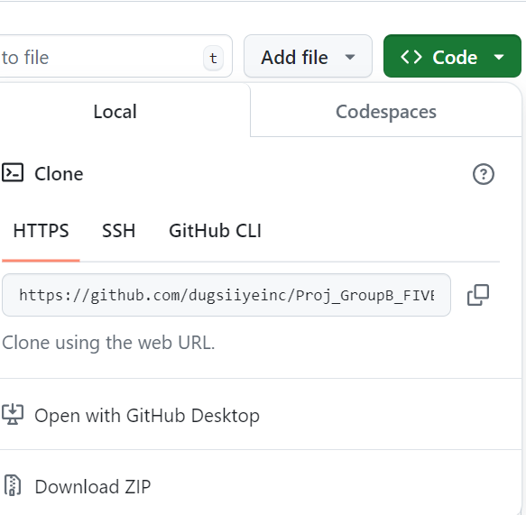

# Group B (Group 5) Project
- Welcome to the repository for the Group B (Group 5) Project.

# Team members

1. Mohamed Bashir Ali (team leader) (https://github.com/MBASHIR08)
2. Abdullahi Abdirashid(https://github.com/AbdulahiAwil)
3. Khalid Ibrahim Abdi (https://github.com/khalid3009)

# Introduction
This project is built Group B (Group 5) using the Templete of the Mexant HTML5. It provides a comprehensive solution for business upgrades and professional website development.

# Key Features
- Responsive Designs: Optimized for both mobile and tablet.
- Fully Customizable: Easily modify to suit your needs.
- Fast Customer Support: Reliable assistance for all your queries.
- Free to Use: Available for free download and editing for professional use.

# TOOLS USED
- HTML 
- CSS
- JavaScript

# Pages 

- Home page (index)
- About page
- Service page
- Contact us page

# Installation

1. Download the Template: Clone the repository or download the ZIP file using this link 
            https://github.com/dugsiiyeinc/Proj_GroupB_FIVE.git.
2. .

# Usage

1. Open index.html: Start by opening the index.html file in your preferred web browser to see the template in action.
2. Modify Content: Edit the HTML, CSS, and JS files to customize the template according to your requirements.
3. Deploy: Upload the modified files to your web server or use services like Vercel or Netlify for easy deployment.

# Copyright © 2024 Dugsiiye. Designed by group B Team 5